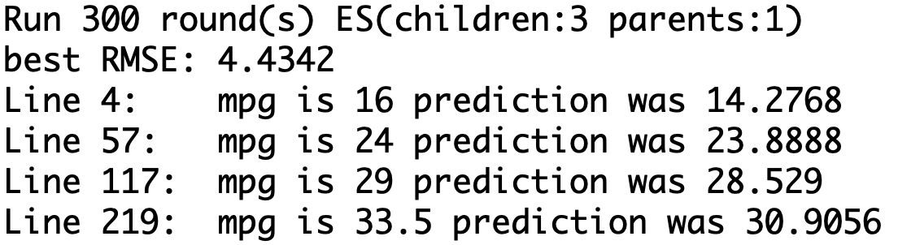

# Machine-Learning-Evolutionary-Strategy<br>
This will take the first 6 columns and predtict the 7th.<br>
Basically it should find good combinations and improve them step by step.<br>

Install Octave on a Mac with <b>Homebrew Cask</b>: <br>
```
brew tap octave-app/octave-app
brew cask install octave-app
```

## Preview<br>

